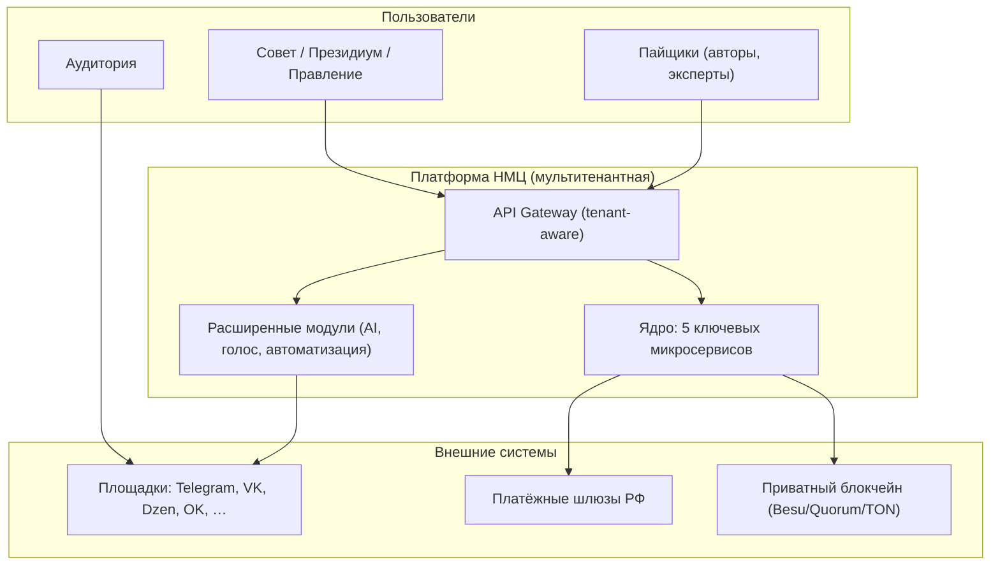
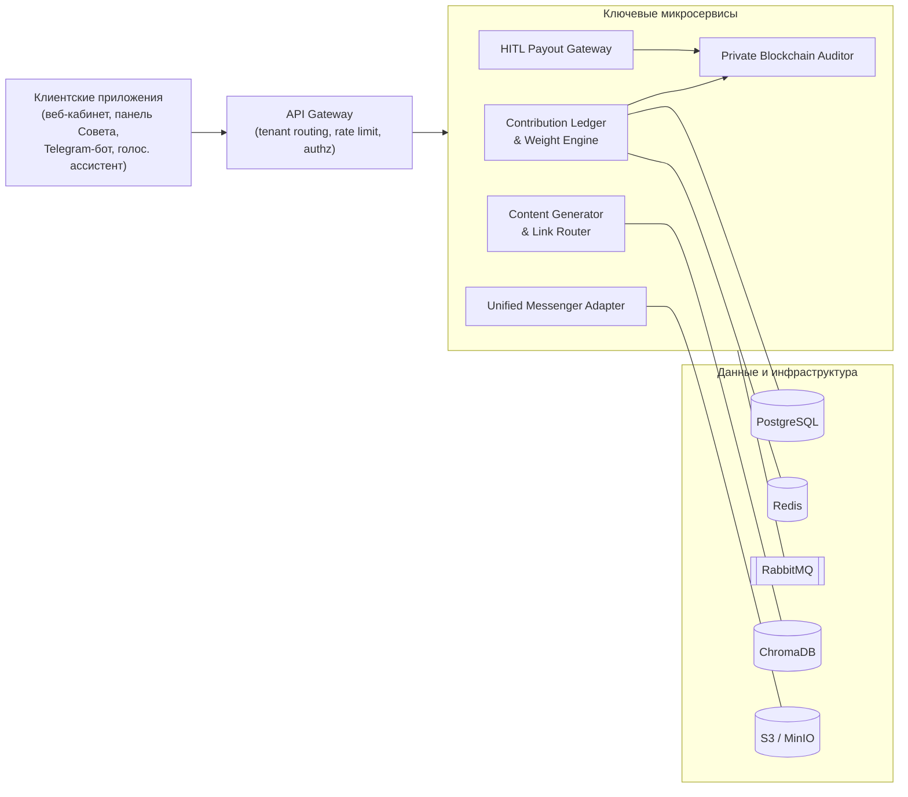
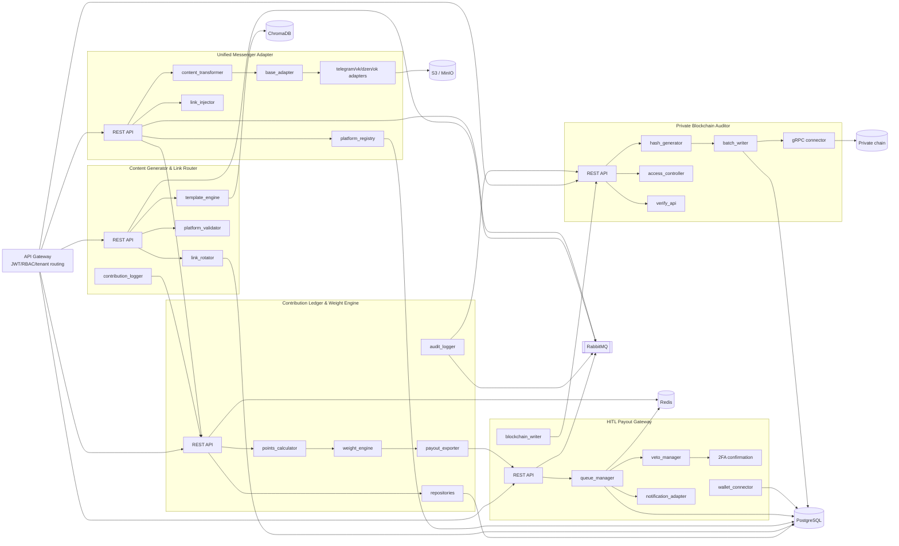
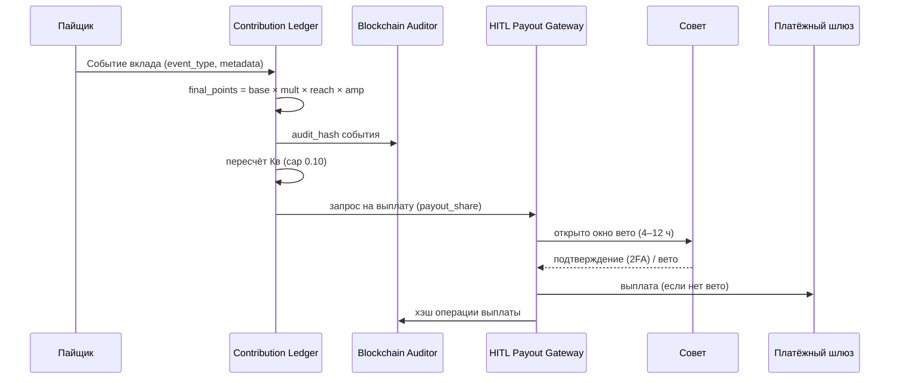
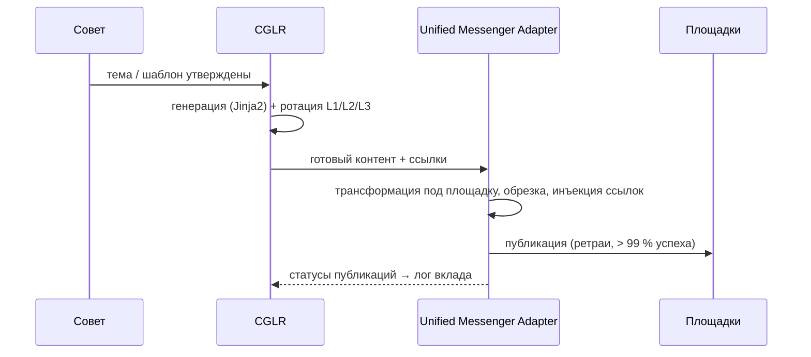

# Архитектура системы НМЦ

Документ описывает целевую архитектуру платформы: контекст, контейнеры,
компоненты ключевых сервисов, технологический стек, потоки данных,
мультитенантность, кросс-функциональные слои и базовые контракты
взаимодействия.

> Архитектура — целевая (to-be). Конкретные технологические решения фиксируются через ADR (Architecture Decision Records) на этапе 0 (см. [ROADMAP.md](ROADMAP.md)).

Статус baseline для issue
[#5](https://github.com/xlabtg/Media_Center/issues/5): C4-диаграммы зафиксированы
в этом документе, ADR-журнал — в [adr/README.md](adr/README.md), контракты
межсервисного взаимодействия — в [contracts/README.md](contracts/README.md).

---

## 1. Принципы

1. **Мультитенантность по умолчанию.** `tenant_id` присутствует во всех записях БД, векторных коллекциях, логах, событиях и выплатах. Источник истины — JWT. Межтенантный доступ запрещён и возвращает `403 tenant_isolation_violation`.
2. **Human-in-the-Loop.** Чувствительные операции проходят через окна вето и пороги, заданные Советом.
3. **Микросервисы со слабой связанностью.** Сервисы общаются через API Gateway (синхронно) и RabbitMQ (асинхронно, события).
4. **Проверяемость.** Ключевые операции фиксируются хэшами в приватном блокчейне.
5. **Безопасность и приватность по дизайну.** Шифрование, минимизация данных, хранение чувствительных данных на стороне клиента.

---

## 2. Контекст системы (C4 — Level 1)

---

## 3. Контейнеры (C4 — Level 2)

---

## 4. Компоненты ключевых сервисов (C4 — Level 3 / Component Level)

Диаграмма фиксирует компонентные границы пяти основных сервисов, их владение
данными и направления синхронного/асинхронного обмена. Подробные контракты
эндпоинтов и событий вынесены в [contracts/](contracts/).

### 4.1. Компонентные границы

| Сервис | Публичный API | Внутренние компоненты | Владелец данных | Публикует события |
|--------|---------------|-----------------------|-----------------|-------------------|
| Contribution Ledger & Weight Engine | Учёт вклада, веса Кв, экспорт долей | `points_calculator`, `weight_engine`, `payout_exporter`, `audit_logger` | `contributions`, `tenant_weights` | `contribution.recorded`, `weights.recalculated`, `payout.distribution_ready`, `audit.record.requested` |
| CGLR | Генерация контента, ссылки L1/L2/L3 | `template_engine`, `link_rotator`, `platform_validator`, `contribution_logger` | `templates`, `generated_content`, `link_routes` | `content.generated`, `content.validation_failed`, `contribution.record_requested` |
| Unified Messenger Adapter | Публикация и реестр площадок | `base_adapter`, площадочные адаптеры, `content_transformer`, `link_injector`, `platform_registry` | `platform_registry`, `platform_tokens`, `publication_jobs` | `publication.requested`, `publication.succeeded`, `publication.failed` |
| HITL Payout Gateway | Очередь выплат, вето, 2FA | `queue_manager`, `veto_manager`, `notification_adapter`, `wallet_connector`, `blockchain_writer` | `payouts`, `veto_decisions`, `approval_sessions` | `payout.queued`, `payout.vetoed`, `payout.confirmed`, `payout.executed`, `audit.record.requested` |
| Private Blockchain Auditor | Запись и проверка audit hash | `hash_generator`, `access_controller`, `batch_writer`, `blockchain_connector`, `verify_api` | `audit_records`, `audit_batches` | `audit.recorded`, `audit.verify_requested`, `audit.verify_completed` |

### 4.2. Правила взаимодействия компонентов

- Внешние клиенты обращаются только через API Gateway; прямой доступ к сервисам
  разрешён только внутри приватной сети сервисов.
- `tenant_id` извлекается из JWT на Gateway и передаётся сервисам как
  проверенный контекст; тело запроса не может переопределить tenant.
- Запросы, влияющие на деньги, статусы, массовые действия, политики или
  публикации, проходят через RBAC и HITL-правила.
- Асинхронные события доставляются через RabbitMQ с идемпотентным
  `event_id`, `correlation_id` и tenant-aware routing key.
- Blockchain Auditor принимает только SHA256-хэш и технические метаданные; ПДн,
  денежные суммы, токены площадок и тексты материалов в audit-chain payload не
  передаются.

---

## 5. Ключевые микросервисы (5)

### 5.1. Contribution Ledger & Weight Engine
Учёт вклада участников и расчёт весов.
- **Назначение:** приём событий вклада, начисление баллов, расчёт Кв, экспорт выплат, журнал аудита.
- **Ключевые компоненты:** `points_calculator.py`, `weight_engine.py`, `payout_exporter.py`, `utils/audit_logger.py`, `models/contributions.py`.
- **Формулы:** `final_points = round(base × platform_mult × reach_mult × amp_mult, 2)`; `Кв = min(баллы / avg_по_Совету; 0.10)`; `payout_share = kv_capped / Σ kv_capped`.
- **Стек:** FastAPI, SQLAlchemy async, PostgreSQL, Redis.
- Спецификация: [modules/contribution-ledger.md](modules/contribution-ledger.md).

### 5.2. Content Generator & Link Router (CGLR)
Генерация контента и маршрутизация ссылок.
- **Назначение:** генерация контента по шаблонам Jinja2, ротация ссылок L1/L2/L3, валидация под площадку, логирование вклада.
- **Ключевые компоненты:** `template_engine.py`, `link_rotator.py`, `platform_validator.py`, `contribution_logger.py`.
- **Стек:** FastAPI, Jinja2, ChromaDB (контекст/память), Redis.
- Спецификация: [modules/cglr.md](modules/cglr.md).

### 5.3. HITL Payout Gateway
Шлюз выплат с контролем человека.
- **Назначение:** очередь выплат, окно вето (4–12 ч, по умолчанию 8), 2FA-подтверждение, интеграция с платёжными шлюзами РФ, запись хэша в блокчейн.
- **Ключевые компоненты:** `queue_manager.py`, `veto_manager.py` (критический), `notification_adapter.py`, `blockchain_writer.py`, `wallet_connector.py`.
- **Стек:** FastAPI, RabbitMQ, Redis, PostgreSQL.
- Спецификация: [modules/hitl-payout-gateway.md](modules/hitl-payout-gateway.md).

### 5.4. Unified Messenger Adapter
Единый адаптер к площадкам.
- **Назначение:** публикация на десятках площадок через единый интерфейс, трансформация контента под площадку, инъекция ссылок, умная обрезка, ретраи, шифрование токенов на стороне клиента.
- **Ключевые компоненты:** `base_adapter.py`, `telegram_adapter.py`, `vk_adapter.py`, `dzen_adapter.py`, `ok_adapter.py`, `content_transformer.py`, `link_injector.py`, `smart_truncate.py`.
- **Стек:** FastAPI, Telethon/VK API, Playwright, RabbitMQ.
- Спецификация: [modules/messenger-adapter.md](modules/messenger-adapter.md).

### 5.5. Private Blockchain Auditor
Аудит операций в приватном блокчейне.
- **Назначение:** запись SHA256-хэшей операций и метаданных, проверка целостности, доступ только для Совета, пакетная запись.
- **Ключевые компоненты:** `blockchain_connector.py`, `hash_generator.py`, `access_controller.py`, `batch_writer.py`.
- **Стек:** FastAPI, gRPC, Hyperledger Besu/Quorum или приватный шард TON.
- **Важно:** в блокчейн записываются только хэши и метаданные — **без сумм и персональных данных**.
- Спецификация: [modules/blockchain-auditor.md](modules/blockchain-auditor.md).

---

## 6. Вспомогательные модули

| Модуль | Назначение | Спецификация |
|--------|------------|--------------|
| **Activity Command Center** | Backend панели Совета/администратора: мониторинг активности, управление порогами и вето. | [modules/activity-command-center.md](modules/activity-command-center.md) |
| **Neuro-Agent Orchestrator** | Оркестрация ИИ-агентов автоматизации: 4 подмодуля — Аудитория&Парсинг, Вовлечение&Авто-ответы, Контент&Гигиена, Аналитика&Оптимизация. | [modules/neuro-agent-orchestrator.md](modules/neuro-agent-orchestrator.md) |
| **Voice-to-Chain** | Голос → Whisper.cpp (локально) → хэш транскрипта в блокчейн; авто-удаление сырого звука за 24 ч. | [modules/voice-to-chain.md](modules/voice-to-chain.md) |
| **Wallet Module** | Учёт МСЦ и балансов пайщиков. | [modules/wallet.md](modules/wallet.md) |
| **Analytics Engine** | Расчёт KPI, коэффициента вовлечённости, аналитика контента. | [modules/analytics-engine.md](modules/analytics-engine.md) |
| **Notification Gateway** | Единая отправка уведомлений (вето, выплаты, события). | [modules/notification-gateway.md](modules/notification-gateway.md) |
| **Policy Manager** | Управление порогами, этическими правилами, конфигурацией RL-KPI. | [modules/policy-manager.md](modules/policy-manager.md) |
| **API Gateway** | Tenant-aware маршрутизация, лимиты, авторизация. | [modules/api-gateway.md](modules/api-gateway.md) |
| **Tenant Isolation Layer** | Сквозная изоляция тенантов на всех слоях. | [modules/tenant-isolation.md](modules/tenant-isolation.md) |

---

## 7. Технологический стек

| Слой | Технологии |
|------|------------|
| **Язык / фреймворк** | Python 3.11+, FastAPI, Pydantic v2 |
| **ORM / миграции** | SQLAlchemy (async, asyncpg), Alembic |
| **Реляционная БД** | PostgreSQL |
| **Кэш** | Redis |
| **Очереди / события** | RabbitMQ |
| **Векторная БД** | ChromaDB |
| **Объектное хранилище** | S3-совместимое (MinIO) |
| **Блокчейн** | Приватный: Hyperledger Besu / Quorum или приватный шард TON; gRPC |
| **AI / голос** | Whisper.cpp, Agentic RAG, DeepResearch, Content Agent (CUA), RL-KPI loop, XAI |
| **Автоматизация** | Telethon, VK API, Playwright, политики ретраев и резервные разрешенные каналы |
| **Шаблоны** | Jinja2 |
| **Безопасность** | JWT (HS256), AES-256, TLS 1.3+, SHA256, 2FA, RBAC |
| **Контейнеризация** | Docker, docker-compose |
| **Наблюдаемость** | Prometheus, Grafana, структурные логи, трейсинг |
| **Тестирование** | pytest |

---

## 8. Контракты взаимодействия

Архитектура использует два класса контрактов:

- **Синхронные REST/gRPC контракты** — клиентские и межсервисные команды через
  API Gateway, внутренние REST-вызовы между доверенными сервисами, gRPC для
  коннектора приватной блокчейн-сети. Детали: [contracts/sync-api.md](contracts/sync-api.md).
- **Асинхронные события RabbitMQ** — факты домена, статусы публикаций, HITL,
  аудит, уведомления и изменения политик. Детали: [contracts/events.md](contracts/events.md).

Базовые правила контрактов:

| Правило | Решение |
|---------|---------|
| Идентичность tenant | Источник истины — JWT; все контракты содержат `tenant_id` в контексте или envelope. |
| Идемпотентность | Команды используют `Idempotency-Key`; события используют стабильный `event_id`. |
| Трассировка | Во всех запросах и событиях обязателен `correlation_id`. |
| Ошибки | Ошибки возвращаются единым envelope с `code`, `message`, `correlation_id`; межтенантный доступ — `403 tenant_isolation_violation`. |
| Приватность | В событиях и audit-chain payload нет ПДн, сумм выплат, токенов площадок и сырого контента без явного разрешения контракта. |

---

## 9. Потоки данных

### 9.1. Учёт вклада → выплата

### 9.2. Генерация и публикация контента

---

## 10. Мультитенантность

- **Идентификация:** `tenant_id` извлекается из JWT при каждом запросе через API Gateway.
- **Данные:** все таблицы содержат `tenant_id` (индексируется); запросы фильтруются по тенанту на уровне репозиториев.
- **Векторы:** коллекции ChromaDB разделяются по тенанту (имя коллекции / метаданные).
- **Хранилище:** объекты S3 разделяются по префиксу `tenant_id/`.
- **Логи и метрики:** содержат `tenant_id` как обязательный label.
- **Контроль:** middleware проверяет соответствие `tenant_id` запроса и ресурса; нарушение → `403 tenant_isolation_violation`.

Подробнее — [modules/tenant-isolation.md](modules/tenant-isolation.md) и [SECURITY.md](SECURITY.md).

---

## 11. Кросс-функциональные слои

- **Аутентификация/авторизация:** JWT + RBAC (роли: Совет, Президиум, Правление, действительный/ассоциативный пайщик).
- **Аудит:** единый `audit_logger`, хэширование событий, запись в блокчейн.
- **Наблюдаемость:** метрики, логи, трейсинг с `tenant_id`.
- **Конфигурация:** `.env` + менеджер секретов; пороги — через Policy Manager.
- **Общая библиотека (shared):** Pydantic-модели, ошибки, аудит-логгер, утилиты тенантов, базовый scaffolding микросервиса.

---

## 12. Модель данных (фрагмент)

**`contributions`**
| Поле | Тип | Примечание |
|------|-----|-----------|
| `id` | UUID | PK |
| `tenant_id` | String(36) | индексируется |
| `event_type` | String | тип события вклада |
| `points_awarded` | Float | начисленные баллы |
| `metadata` | JSON | контекст события |
| `created_at` | DateTime | |
| `audit_hash` | String(64) | SHA256 |

Индексы: `idx_tenant_event (tenant_id, event_type)`, `idx_tenant_date (tenant_id, created_at)`.

**`tenant_weights`**
| Поле | Тип | Примечание |
|------|-----|-----------|
| `tenant_id` | String(36) | PK |
| `period` | String(7) | `YYYY-MM` |
| `total_points` | Float | |
| `avg_points_council` | Float | среднее по Совету |
| `kv_raw` | Float | до ограничения |
| `kv_capped` | Float | после ограничения 0.10 |
| `updated_at` | DateTime | |

Полная модель данных проектируется на этапе 0 (см. issue по проектированию модели данных).

---

## 13. ADR и архитектурные решения

ADR-журнал расположен в [adr/README.md](adr/README.md). На baseline issue #5
приняты следующие решения:

| ADR | Решение | Статус |
|-----|---------|--------|
| [ADR-0001](adr/0001-service-boundaries-and-c4-baseline.md) | Границы микросервисов и C4 baseline | Accepted |
| [ADR-0002](adr/0002-sync-async-integration.md) | Синхронный API Gateway + асинхронный RabbitMQ | Accepted |
| [ADR-0003](adr/0003-tenant-isolation-by-design.md) | Сквозная tenant-изоляция по `tenant_id` | Accepted |
| [ADR-0004](adr/0004-private-blockchain-audit.md) | Приватный audit-chain только для SHA256-хэшей и метаданных | Accepted |
| [ADR-0005](adr/0005-hitl-for-sensitive-operations.md) | HITL-контур для выплат и чувствительных действий | Accepted |

Выбор точных версий библиотек и инфраструктуры будет уточняться отдельными ADR
в рамках issue #6, не меняя базовые архитектурные границы этого документа.

---

## 14. Критерии готовности issue #5

| Критерий | Где зафиксировано |
|----------|-------------------|
| Диаграммы C4 утверждены | Context — раздел 2, Container — раздел 3, Component Level — раздел 4 |
| ADR по ключевым решениям приняты | [adr/README.md](adr/README.md), ADR-0001..ADR-0005 |
| Контракты межсервисного взаимодействия описаны | [contracts/README.md](contracts/README.md), [contracts/sync-api.md](contracts/sync-api.md), [contracts/events.md](contracts/events.md) |

---

## 15. Развёртывание

- **Локально:** docker-compose (PostgreSQL, Redis, RabbitMQ, ChromaDB, MinIO, сервисы).
- **CI/CD:** lint → тесты → сборка образов → security scan → деплой.
- **Прод:** контейнеры с горизонтальным масштабированием; приватная блокчейн-сеть отдельным контуром; доступ к блокчейну — только Совет.

Конфигурация окружения — см. `.env.example` и [SECURITY.md](SECURITY.md).
