# Модель данных и tenant-aware стратегия хранения

Документ фиксирует baseline для issue
[#7](https://github.com/xlabtg/Media_Center/issues/7): ER-модель, индексы,
правила изоляции tenant на всех слоях хранения и подход к миграциям.

Статус: `Accepted` как проектный baseline этапа 0. Реализация таблиц,
SQLAlchemy-моделей и Alembic-миграций выполняется в задачах этапов 1-2, но не
должна менять эти инварианты без нового ADR.

---

## 1. Инварианты модели

1. `tenant_id` - обязательный контекст всех tenant-owned данных: строка
   `String(64)`, стабильная внутри платформы и пригодная для routing keys,
   prefix paths и labels. Человекочитаемый slug tenant хранится отдельно.
2. Источник истины для пользовательского запроса - проверенный JWT на API
   Gateway. Клиентское тело запроса и внешние headers не могут задавать или
   переопределять `tenant_id`.
3. Каждая tenant-owned таблица содержит `tenant_id NOT NULL`, индексируется по
   нему и использует composite unique/FK, где связь не должна пересекать tenant.
4. Все выборки в репозиториях фильтруются по `tenant_id`; для PostgreSQL
   дополнительно планируется Row Level Security как второй контур защиты.
5. Межтенантный доступ, отсутствие tenant context или несовпадение tenant
   ресурса и JWT возвращает `403 tenant_isolation_violation` и создаёт
   аудит-событие `tenant.isolation_violation`.
6. В audit-chain, событиях, логах и метриках не передаются ПДн, токены площадок,
   денежные суммы и сырой контент, если конкретный контракт явно не разрешает
   поле и не указывает основание.

---

## 2. Владение данными

| Область | Владелец | Основные таблицы / хранилища |
|---------|----------|-------------------------------|
| Tenant foundation | API Gateway / shared tenant core | `tenants`, `tenant_settings`, tenant context utilities |
| Участники и роли | Identity/RBAC layer | `members`, `member_consents`, `role_assignments` |
| Учёт вклада | Contribution Ledger & Weight Engine | `contributions`, `tenant_weights`, `payout_distributions` |
| Контент и ссылки | CGLR | `templates`, `generated_content`, `link_routes`, ChromaDB collections |
| Публикации | Unified Messenger Adapter | `platform_registry`, `platform_tokens`, `publication_jobs`, S3 / MinIO objects |
| HITL и выплаты | HITL Payout Gateway / Wallet | `payouts`, `veto_decisions`, `approval_sessions`, `wallet_operations` |
| Аудит | Private Blockchain Auditor | `audit_records`, `audit_batches`, private audit-chain |
| Политики и операции | Policy Manager / Activity Command Center | `policies`, `tasks`, `notifications`, `metric_snapshots` |
| Интеграция | Shared infrastructure | `outbox_events`, `inbox_events`, RabbitMQ, Redis |

---

## 3. ER-модель

```mermaid
erDiagram
    tenants ||--o{ tenant_settings : configures
    tenants ||--o{ members : owns
    tenants ||--o{ member_consents : owns
    tenants ||--o{ role_assignments : owns
    tenants ||--o{ policies : owns
    tenants ||--o{ contributions : owns
    tenants ||--o{ tenant_weights : owns
    tenants ||--o{ payout_distributions : owns
    tenants ||--o{ templates : owns
    tenants ||--o{ generated_content : owns
    tenants ||--o{ link_routes : owns
    tenants ||--o{ platform_registry : owns
    tenants ||--o{ platform_tokens : owns
    tenants ||--o{ publication_jobs : owns
    tenants ||--o{ payouts : owns
    tenants ||--o{ veto_decisions : owns
    tenants ||--o{ approval_sessions : owns
    tenants ||--o{ wallet_operations : owns
    tenants ||--o{ audit_records : owns
    tenants ||--o{ audit_batches : owns
    tenants ||--o{ tasks : owns
    tenants ||--o{ notifications : owns
    tenants ||--o{ metric_snapshots : owns
    tenants ||--o{ outbox_events : owns
    tenants ||--o{ inbox_events : owns

    members ||--o{ contributions : authors
    members ||--o{ tenant_weights : has_weight
    members ||--o{ role_assignments : receives_role
    members ||--o{ member_consents : grants
    members ||--o{ payouts : receives
    members ||--o{ wallet_operations : owns

    contributions ||--o{ audit_records : audited_by
    tenant_weights ||--o{ payout_distributions : contributes_to
    generated_content ||--o{ publication_jobs : published_as
    publication_jobs ||--o{ contributions : may_record
    payouts ||--o{ veto_decisions : controlled_by
    payouts ||--o{ approval_sessions : confirmed_by
    payouts ||--o{ wallet_operations : creates
    audit_batches ||--o{ audit_records : batches
```



Диаграмма показывает tenant-owned границы. Конкретные сервисы могут иметь
отдельные физические базы, но связи и поля сохраняют тот же tenant contract.

---

## 4. PostgreSQL 17: таблицы и ключи

### 4.1. Tenant foundation

**`tenants`** - системный реестр tenant'ов.

| Поле | Тип | Правило |
|------|-----|---------|
| `tenant_id` | `String(64)` | PK, opaque ID для API, событий, logs, metrics, storage prefixes |
| `slug` | `String(64)` | Unique, человекочитаемый идентификатор |
| `name` | `String(256)` | Отображаемое имя |
| `status` | `String(32)` | `active`, `suspended`, `archived` |
| `created_at` | `DateTime(timezone=True)` | UTC |
| `updated_at` | `DateTime(timezone=True)` | UTC |

Индексы: `uq_tenants_slug (slug)`, `idx_tenants_status (status)`.

**`tenant_settings`** - настройки tenant и feature flags.

Ключевые поля: `id`, `tenant_id`, `key`, `value_json`, `version`,
`updated_by`, `updated_at`.

Индексы: `uq_tenant_settings_tenant_key (tenant_id, key)`,
`idx_tenant_settings_tenant_updated (tenant_id, updated_at)`.

### 4.2. Участники, согласия и роли

**`members`**

Ключевые поля: `id`, `tenant_id`, `status`, `display_name`, `contacts_json`,
`external_refs_json`, `external_ref_hash`, `created_at`, `updated_at`,
`deleted_at`.

Правила: `contacts_json` хранит только минимально необходимые контакты;
чувствительные значения шифруются на прикладном уровне или выносятся в
секретное хранилище при реализации.

Индексы: `idx_members_tenant_status (tenant_id, status)`,
`idx_members_tenant_created (tenant_id, created_at)`,
`uq_members_tenant_external_ref_hash (tenant_id, external_ref_hash)`.

**`member_consents`**

Ключевые поля: `id`, `tenant_id`, `member_id`, `consent_type`, `status`,
`version`, `granted_at`, `revoked_at`, `evidence_hash`.

Индексы: `idx_member_consents_tenant_member (tenant_id, member_id)`,
`idx_member_consents_tenant_type_status (tenant_id, consent_type, status)`.

**`role_assignments`**

Ключевые поля: `id`, `tenant_id`, `member_id`, `role`, `scope`, `granted_by`,
`valid_from`, `valid_until`, `revoked_at`.

Индексы: `idx_role_assignments_tenant_member (tenant_id, member_id)`,
`idx_role_assignments_tenant_role (tenant_id, role)`.

### 4.3. Contribution Ledger & Weight Engine

**`contributions`** - факты вклада, начисленные баллы и audit hash.

| Поле | Тип | Правило |
|------|-----|---------|
| `id` | `UUID` | PK |
| `tenant_id` | `String(64)` | NOT NULL, FK на `tenants` |
| `member_id` | `UUID` | Автор вклада внутри того же tenant |
| `event_type` | `String(64)` | Тип вклада из каталога Contribution Ledger |
| `source_type` | `String(64)` | `manual`, `publication`, `referral`, `task`, `ai_action`, ... |
| `source_ref` | `String(128)` | ID внешнего/внутреннего источника без ПДн |
| `points_awarded` | `Numeric(12,2)` | `>= 0` |
| `metadata` | `JSONB` | Без ПДн, токенов и сырого контента |
| `audit_hash` | `Char(64)` | SHA256 canonical payload |
| `idempotency_key` | `String(128)` | Защита от дублей side effects |
| `occurred_at` | `DateTime(timezone=True)` | Время события |
| `created_at` | `DateTime(timezone=True)` | Время записи |

Ограничения: `ck_contributions_points_non_negative`,
`uq_contributions_tenant_idempotency (tenant_id, idempotency_key)`,
tenant-aware FK `(tenant_id, member_id)` на `members`.

Индексы: `idx_contributions_tenant_event_created (tenant_id, event_type, created_at)`,
`idx_contributions_tenant_member_occurred (tenant_id, member_id, occurred_at)`,
`idx_contributions_tenant_source (tenant_id, source_type, source_ref)`,
`idx_contributions_audit_hash (audit_hash)`.

**`tenant_weights`** - расчёт Кв и долей по участникам за период.

| Поле | Тип | Правило |
|------|-----|---------|
| `id` | `UUID` | PK |
| `tenant_id` | `String(64)` | NOT NULL |
| `member_id` | `UUID` | Участник tenant |
| `period` | `String(7)` | `YYYY-MM` |
| `total_points` | `Numeric(14,2)` | Сумма баллов за период |
| `avg_points_council` | `Numeric(14,2)` | Среднее по Совету |
| `kv_raw` | `Numeric(12,6)` | До ограничения |
| `kv_capped` | `Numeric(6,5)` | `<= 0.10` |
| `payout_share` | `Numeric(12,10)` | Доля для распределения |
| `calculation_hash` | `Char(64)` | SHA256 входных агрегатов |
| `calculated_at` | `DateTime(timezone=True)` | UTC |
| `updated_at` | `DateTime(timezone=True)` | UTC |

Ограничения: `uq_tenant_weights_tenant_member_period (tenant_id, member_id, period)`,
`ck_tenant_weights_kv_cap (kv_capped <= 0.10)`.

Индексы: `idx_tenant_weights_tenant_period (tenant_id, period)`,
`idx_tenant_weights_tenant_period_kv (tenant_id, period, kv_capped)`,
`idx_tenant_weights_calculation_hash (calculation_hash)`.

**`payout_distributions`** - immutable snapshot долей, передаваемый в HITL.

Ключевые поля: `id`, `tenant_id`, `period`, `status`, `total_kv_capped`,
`total_payout_share`, `member_count`, `distribution_json`, `distribution_hash`,
`created_by`, `created_at`.

Ограничения: `ck_payout_distributions_values_non_negative`,
`ck_payout_distributions_payout_share (total_payout_share <= 1)`,
`uq_payout_distributions_tenant_hash (tenant_id, distribution_hash)`.

Индексы: `idx_payout_distributions_tenant_period (tenant_id, period)`,
`idx_payout_distributions_tenant_status (tenant_id, status)`,
`uq_payout_distributions_tenant_hash (tenant_id, distribution_hash)`.

### 4.4. Контент, ссылки и публикации

**`templates`**: `id`, `tenant_id`, `name`, `body`, `version`, `status`,
`policy_key`, `created_by`, `updated_at`.

Индексы: `uq_templates_tenant_name_version (tenant_id, name, version)`,
`idx_templates_tenant_status (tenant_id, status)`.

**`generated_content`**: `id`, `tenant_id`, `template_id`, `content_hash`,
`payload_ref`, `metadata`, `status`, `created_at`.

Индексы: `idx_generated_content_tenant_status (tenant_id, status)`,
`idx_generated_content_tenant_template (tenant_id, template_id)`.

**`link_routes`**: `id`, `tenant_id`, `route_type`, `target_ref`,
`weight_threshold`, `status`, `updated_at`.

Индексы: `idx_link_routes_tenant_type_status (tenant_id, route_type, status)`.

**`platform_registry`**: `id`, `tenant_id`, `platform`, `limits_json`,
`priority`, `status`, `updated_at`.

Индексы: `uq_platform_registry_tenant_platform (tenant_id, platform)`,
`idx_platform_registry_tenant_status_priority (tenant_id, status, priority)`.

**`platform_tokens`**: `id`, `tenant_id`, `platform`, `token_ref`,
`token_encrypted`, `status`, `rotated_at`.

Правило: токены не пишутся в логи, события или audit-chain; доступ только через
адаптер и секретный контур.

Индексы: `uq_platform_tokens_tenant_platform (tenant_id, platform)`.

**`publication_jobs`**: `id`, `tenant_id`, `content_id`, `platform`,
`platform_post_ref`, `status`, `retry_count`, `last_error_code`, `published_at`,
`created_at`.

Индексы: `idx_publication_jobs_tenant_status (tenant_id, status)`,
`idx_publication_jobs_tenant_platform_status (tenant_id, platform, status)`,
`idx_publication_jobs_tenant_content (tenant_id, content_id)`.

### 4.5. HITL, wallet и аудит

**`payouts`**: `id`, `tenant_id`, `member_id`, `period`, `distribution_id`,
`share`, `status`, `veto_until`, `audit_hash`, `created_at`.

Индексы: `idx_payouts_tenant_status (tenant_id, status)`,
`idx_payouts_tenant_member_period (tenant_id, member_id, period)`,
`idx_payouts_audit_hash (audit_hash)`.

**`veto_decisions`**: `id`, `tenant_id`, `payout_id`, `decision`,
`reason_code`, `decided_by`, `audit_hash`, `created_at`.

Индексы: `idx_veto_decisions_tenant_payout (tenant_id, payout_id)`,
`idx_veto_decisions_tenant_created (tenant_id, created_at)`.

**`approval_sessions`**: `id`, `tenant_id`, `resource_type`, `resource_id`,
`status`, `requires_2fa`, `expires_at`, `confirmed_at`.

Индексы: `idx_approval_sessions_tenant_resource (tenant_id, resource_type, resource_id)`,
`idx_approval_sessions_tenant_status_expires (tenant_id, status, expires_at)`.

**`wallet_operations`**: `id`, `tenant_id`, `member_id`, `amount_mcv`, `type`,
`ref_type`, `ref_id`, `audit_hash`, `created_at`.

Индексы: `idx_wallet_operations_tenant_member_created (tenant_id, member_id, created_at)`,
`idx_wallet_operations_tenant_ref (tenant_id, ref_type, ref_id)`.

**`audit_records`**: `id`, `tenant_id`, `event_id`, `event_type`,
`source_service`, `hash`, `metadata`, `block_ref`, `batch_id`, `created_at`.

Индексы: `uq_audit_records_tenant_event (tenant_id, event_id)`,
`idx_audit_records_tenant_type_created (tenant_id, event_type, created_at)`,
`idx_audit_records_hash (hash)`.

**`audit_batches`**: `id`, `tenant_id`, `batch_hash`, `block_ref`, `status`,
`record_count`, `created_at`, `recorded_at`.

Индексы: `idx_audit_batches_tenant_status (tenant_id, status)`,
`idx_audit_batches_block_ref (block_ref)`.

### 4.6. Политики, задачи, уведомления и интеграция

**`policies`**: `id`, `tenant_id`, `key`, `value`, `version`, `status`,
`updated_by`, `updated_at`, `audit_hash`.

Индексы: `uq_policies_tenant_key_version (tenant_id, key, version)`,
`idx_policies_tenant_key_status (tenant_id, key, status)`.

**`tasks`**: `id`, `tenant_id`, `type`, `payload`, `status`, `assignee_id`,
`due_at`, `created_at`.

Индексы: `idx_tasks_tenant_status_due (tenant_id, status, due_at)`,
`idx_tasks_tenant_assignee (tenant_id, assignee_id)`.

**`notifications`**: `id`, `tenant_id`, `recipient_ref`, `channel`,
`template_key`, `payload`, `status`, `created_at`, `delivered_at`.

Индексы: `idx_notifications_tenant_status_created (tenant_id, status, created_at)`,
`idx_notifications_tenant_recipient (tenant_id, recipient_ref)`.

**`metric_snapshots`**: `id`, `tenant_id`, `metric_key`, `period`,
`labels_json`, `value`, `captured_at`.

Индексы: `idx_metric_snapshots_tenant_metric_period (tenant_id, metric_key, period)`.

**`outbox_events`**: `id`, `tenant_id`, `event_type`, `event_id`, `payload`,
`routing_key`, `status`, `attempts`, `created_at`, `published_at`.

Индексы: `uq_outbox_events_tenant_event (tenant_id, event_id)`,
`idx_outbox_events_tenant_status_created (tenant_id, status, created_at)`.

**`inbox_events`**: `id`, `tenant_id`, `event_id`, `source`, `status`,
`processed_at`, `created_at`.

Индексы: `uq_inbox_events_tenant_event_source (tenant_id, event_id, source)`,
`idx_inbox_events_tenant_status_created (tenant_id, status, created_at)`.

---

## 5. Общие правила индексации

- Каждая tenant-owned таблица имеет минимум один selective индекс, начинающийся
  с `tenant_id`, и отдельные индексы под частые фильтры `status`, `period`,
  `created_at`, `member_id`.
- Unique constraints для доменных ключей всегда включают `tenant_id`, кроме
  глобально системных таблиц (`tenants`, `alembic_version`).
- Внешние ключи между tenant-owned таблицами должны включать `tenant_id` или
  проверяться сервисным инвариантом до записи. Предпочтение - composite FK
  `(tenant_id, referenced_id)`.
- `JSONB` используется для расширяемых метаданных, но не заменяет нормальные
  поля, по которым нужны фильтры, ограничения или join.
- Индексы для больших таблиц в production создаются через
  `CREATE INDEX CONCURRENTLY` отдельными Alembic-ревизиями.

---

## 6. Изоляция на слоях хранения

| Слой | Стратегия tenant isolation | Проверка нарушения |
|------|----------------------------|--------------------|
| PostgreSQL | `tenant_id NOT NULL`, repository filters, composite FK/unique, Row Level Security после появления shared DB session context | Middleware/repository возвращает `403 tenant_isolation_violation`; нарушение пишется в `audit_records` и `tenant.isolation_violation` |
| Redis | Ключи вида `tenant:{tenant_id}:{domain}:{key}`, tenant-aware locks, TTL для временных данных | Запрещены операции без tenant prefix; shared/system keys только по allowlist |
| RabbitMQ | Routing key `tenant.<tenant_id>.<domain>.<event>`, envelope содержит тот же `tenant_id` | Consumer повторно сравнивает routing tenant и envelope tenant |
| ChromaDB | Коллекции `nmc_<env>_<tenant_id>_<domain>`; каждый документ также хранит metadata `tenant_id`, `source_ref`, `content_hash` | Query выполняется только внутри tenant collection и с metadata filter |
| S3 / MinIO | Prefix `tenants/{tenant_id}/{domain}/{object_id}`; object metadata содержит `tenant_id`, `correlation_id`, `content_hash` | Сервис не выдаёт list/get/put без tenant prefix; IAM policy ограничивает prefix |
| Логи | Структурные логи с `tenant_id`, `correlation_id`, `actor_hash`; без ПДн, токенов, сырого контента | Security audit событие при tenant mismatch или попытке логировать запрещённое поле |
| Метрики | Prometheus labels `tenant_id`, `service`, `operation`, `status`; high-cardinality user labels запрещены | Dashboard/alert queries всегда фильтруют tenant или показывают агрегаты без ПДн |
| Трейсинг | `tenant_id` и `correlation_id` как span attributes | Sampling и exporter не включают payload с ПДн |
| Audit-chain | Только `tenant_id`, `event_id`, `event_type`, `status`, timestamp, SHA256 hash и технические metadata | Payload с ПДн/суммами отклоняется до записи |
| Backups / restore | Backup на уровне кластера; per-tenant export только через tenant-aware сервисный job | Restore drills проверяют отсутствие cross-tenant выдачи |

---

## 7. Контроль `403 tenant_isolation_violation`

Алгоритм обработки:

1. API Gateway проверяет JWT, извлекает `tenant_id`, роли и `actor_hash`.
2. Gateway прокидывает tenant context в trusted internal header
   `X-Tenant-Id`; внешние клиенты не могут задавать этот header.
3. Сервисная middleware отказывает запросу без tenant context.
4. Repository получает `tenant_id` отдельным аргументом из контекста, а не из
   request body.
5. Если ресурс найден с другим tenant или запрос явно указывает чужой tenant,
   сервис возвращает единый error envelope:

```json
{
  "error": {
    "code": "tenant_isolation_violation",
    "message": "Доступ к ресурсу другого tenant запрещён",
    "details": {},
    "correlation_id": "01HX0000000000000000000000"
  }
}
```

6. Сервис публикует `tenant.isolation_violation` с hash-полями
   `requested_tenant_hash`, `actor_hash`, `resource_type`, `correlation_id`.
7. Повторяющиеся нарушения попадают в security alerts и Activity Command Center.

---

## 8. Alembic и план миграций

### 8.1. Организация ревизий

- Каждый сервис, владеющий PostgreSQL-таблицами, получает собственный каталог
  Alembic и свою цепочку ревизий. Если на раннем MVP используется одна БД,
  схемы разделяются по service-owned таблицам и общим naming conventions.
- Первая ревизия tenant foundation создаёт `tenants`, `tenant_settings` и
  baseline constraints; сервисные ревизии создают доменные таблицы после неё.
- `alembic_version` - системная таблица без `tenant_id`; остальные исключения
  должны быть явно перечислены в allowlist миграционного линтера.

### 8.2. Naming conventions

| Тип | Формат |
|-----|--------|
| Primary key | `pk_<table>` |
| Foreign key | `fk_<table>_<column>_<ref_table>` |
| Unique | `uq_<table>_<columns>` |
| Check | `ck_<table>_<rule>` |
| Index | `idx_<table>_<columns>` |

Имена из раздела 4 являются baseline для будущих SQLAlchemy metadata и
Alembic-скриптов.

### 8.3. Безопасная эволюция схемы

1. **Expand:** добавить nullable поле/таблицу/индекс без изменения поведения.
2. **Backfill:** заполнить данные tenant-aware job'ом с обязательным
   `WHERE tenant_id = :tenant_id` или батчами по tenant.
3. **Contract:** включить `NOT NULL`, unique/check constraints, удалить старое
   поле после завершения миграционного окна.
4. **Verify:** прогнать tenant isolation tests, migration smoke test и
   `git diff --check`.

### 8.4. Row Level Security

RLS включается после появления shared DB session context:

- при открытии транзакции сервис устанавливает `SET LOCAL nmc.tenant_id = ...`;
- policy для tenant-owned таблицы проверяет
  `tenant_id = current_setting('nmc.tenant_id', true)`;
- service/admin jobs, которым нужен cross-tenant обход, требуют отдельной роли,
  аудит-события и явного allowlist.

RLS не заменяет repository filters и middleware, а работает как defence in
depth.

---

## 9. Критерии готовности issue #7

| Критерий | Где зафиксировано |
|----------|-------------------|
| ER-модель и индексы утверждены | Разделы 3-5 этого документа |
| Стратегия изоляции описана для всех слоёв хранения | Разделы 6-7 этого документа, [SECURITY.md](SECURITY.md) |
| План миграций определён | Раздел 8 этого документа |
| Решение принято как архитектурный baseline | [ADR-0007](adr/0007-data-model-and-tenant-storage.md) |
