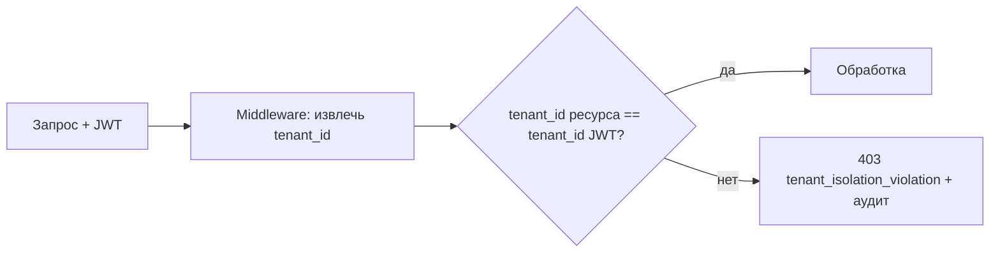

# Модель безопасности НМЦ

Документ описывает требования безопасности, мультитенантную изоляцию, модель угроз (высокоуровнево) и криптографические решения. Детализируется в задачах этапов 0, 1 и 6 (см. [ROADMAP.md](ROADMAP.md)).

---

## 1. Криптография и протоколы

| Назначение | Решение |
|------------|---------|
| Аутентификация (токены) | JWT, алгоритм HS256 (`JWT_ALGORITHM=HS256`) |
| Шифрование данных «в покое» | AES-256 |
| Транспорт | TLS 1.3+ |
| Хэширование (аудит, целостность) | SHA256 |
| Двухфакторная аутентификация | 2FA (для чувствительных операций, напр. подтверждение выплат) |
| Контроль доступа | RBAC (роли см. [GOVERNANCE.md](GOVERNANCE.md)) |

---

## 2. Мультитенантная изоляция

Изоляция тенантов — **базовое требование безопасности**.

- `tenant_id` извлекается из проверенного JWT и обязателен в каждом запросе.
- Все слои (БД, кэш, очереди, векторная БД, объектное хранилище, логи, метрики) разделяют данные по `tenant_id`.
- Репозитории и middleware принудительно фильтруют по `tenant_id`.
- Любая попытка доступа к ресурсу другого тенанта → `403` с кодом `tenant_isolation_violation` и записью в аудит.
- Тесты изоляции — обязательная часть приёмки (этап 6).
- Детальная ER-модель, индексы, правила хранения и Alembic-план зафиксированы
  в [DATA_MODEL.md](DATA_MODEL.md) и [ADR-0007](adr/0007-data-model-and-tenant-storage.md).

---

## 3. Аутентификация и авторизация

- **Аутентификация:** JWT (HS256), refresh-токены, 2FA для чувствительных действий.
- **Авторизация:** RBAC по ролям (`council`, `presidium`, `board`, `member_full`, `member_assoc`, `audience`).
- **Принцип наименьших привилегий:** доступ к блокчейн-аудиту — только у Совета (`access_controller.py` в Blockchain Auditor).

---

## 4. Защита данных

- **Минимизация:** на сервере хранится минимум ПДн; чувствительные данные — на стороне клиента.
- **Шифрование токенов площадок** на стороне клиента (Unified Messenger Adapter).
- **Авто-удаление** сырых данных (голос) за 24 ч (Voice-to-Chain).
- **Блокчейн:** только хэши и метаданные, без сумм и ПДн.
- **Согласия и удаление:** API управления согласиями и удалением данных (ФЗ-152, см. [COMPLIANCE.md](COMPLIANCE.md)).

---

## 5. Модель угроз (высокоуровневая, STRIDE)

| Категория | Пример угрозы | Контрмеры |
|-----------|---------------|-----------|
| **Spoofing** | Подделка идентичности/токена | JWT-подпись, короткое время жизни, 2FA |
| **Tampering** | Изменение данных/операций | SHA256-аудит, блокчейн-хэши, валидация |
| **Repudiation** | Отрицание операции | Журнал аудита, неизменяемые хэши |
| **Information Disclosure** | Утечка данных тенанта | Tenant-изоляция, шифрование, RBAC |
| **Denial of Service** | Перегрузка/недоступность каналов | Rate limiting, ретраи, очереди, резервные разрешенные каналы |
| **Elevation of Privilege** | Повышение привилегий | RBAC, проверка ролей, наименьшие привилегии |

Полная модель угроз разрабатывается на этапе 0 (задача «Threat model»).

---

## 6. Секреты и конфигурация

Параметры окружения (см. `.env.example`):

| Переменная | Назначение |
|------------|------------|
| `DATABASE_URL` | `postgresql+asyncpg://…` |
| `REDIS_URL` | Подключение к Redis |
| `JWT_SECRET` | Секрет подписи JWT |
| `JWT_ALGORITHM` | `HS256` |
| `BLOCKCHAIN_AUDITOR_URL` | Адрес сервиса блокчейн-аудита |
| `VETO_WINDOW_HOURS` | Окно вето (по умолчанию 8) |
| `LOG_LEVEL` | Уровень логирования (`INFO`) |

- Секреты — через менеджер секретов (vault), не в репозитории.
- `.env` — в `.gitignore`; в репозитории только `.env.example`.

---

## 7. Безопасная разработка (SDLC)

- **CI/CD:** статический анализ, проверка зависимостей (SCA), сканирование секретов.
- **Code review:** обязательный для изменений в безопасности и выплатах.
- **Тесты безопасности:** изоляция тенантов, авторизация, негативные сценарии.
- **Pentest:** перед пилотом (этап 6).

---

## 8. Аудит и наблюдаемость

- Единый `audit_logger` фиксирует чувствительные события с `tenant_id`.
- Хэши операций (`audit_hash = SHA256(json.dumps({event_type, tenant_id, points, metadata, timestamp}, sort_keys=True))`).
- Метрики и логи содержат `tenant_id` как обязательный label, но не содержат ПДн.
- Нарушения tenant isolation публикуются как `tenant.isolation_violation` с
  hash-полями, `resource_type` и `correlation_id`, без раскрытия ПДн.

---

## 9. Связь с задачами

- Tenant Isolation Layer, сервис аутентификации, RBAC — этап 1.
- Threat model, стандарты безопасной разработки — этап 0.
- Pentest, аудит ФЗ-152, тесты изоляции — этап 6.
