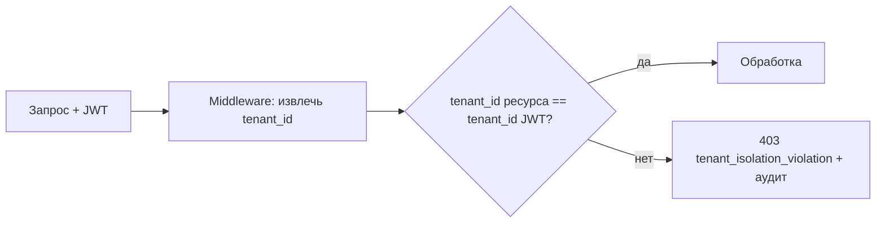

# Модель безопасности НМЦ

Документ описывает требования безопасности, мультитенантную изоляцию, модель угроз (высокоуровнево) и криптографические решения. Детализируется в задачах этапов 0, 1 и 6 (см. [ROADMAP.md](ROADMAP.md)).

Статус: baseline для issue #12. Модель угроз фиксирует проектные инварианты
этапа 0; изменения в ключевых потоках аутентификации, выплат, tenant isolation
или audit-chain требуют обновления этого документа и security review.

---

## 1. Криптография и протоколы

| Назначение | Решение |
|------------|---------|
| Аутентификация (токены) | JWT, алгоритм HS256 (`JWT_ALGORITHM=HS256`) |
| Шифрование данных «в покое» | AES-256 |
| Транспорт | TLS 1.3+ |
| Хэширование (аудит, целостность) | SHA256 |
| Двухфакторная аутентификация | 2FA (для чувствительных операций, напр. подтверждение выплат) |
| Контроль доступа | RBAC (роли см. [GOVERNANCE.md](GOVERNANCE.md)) |

---

## 2. Мультитенантная изоляция

Изоляция тенантов — **базовое требование безопасности**.

- `tenant_id` извлекается из проверенного JWT и обязателен в каждом запросе.
- Все слои (БД, кэш, очереди, векторная БД, объектное хранилище, логи, метрики) разделяют данные по `tenant_id`.
- Репозитории и middleware принудительно фильтруют по `tenant_id`.
- Любая попытка доступа к ресурсу другого тенанта → `403` с кодом `tenant_isolation_violation` и записью в аудит.
- Тесты изоляции — обязательная часть приёмки (этап 6).
- Детальная ER-модель, индексы, правила хранения и Alembic-план зафиксированы
  в [DATA_MODEL.md](DATA_MODEL.md) и [ADR-0007](adr/0007-data-model-and-tenant-storage.md).

---

## 3. Аутентификация и авторизация

- **Аутентификация:** JWT (HS256), refresh-токены, 2FA для чувствительных действий.
- **Авторизация:** RBAC по ролям (`council`, `presidium`, `board`, `member_full`, `member_assoc`, `audience`).
- **Принцип наименьших привилегий:** доступ к блокчейн-аудиту — только у Совета (`access_controller.py` в Blockchain Auditor).

### 3.1. Auth baseline для issue #17

Baseline auth-core реализован в `libs/shared` и используется как основа для API
Gateway и HITL Payout Gateway:

- access-token — JWT HS256 с `typ=access`, `jti`, `tenant_id`, `sub`, `roles`,
  `iss`, `aud`, `iat`, `nbf` и коротким `exp`;
- refresh-token — opaque token, на сервере хранится только SHA256-хэш,
  `tenant_id`, `subject`, роли, срок действия и состояние отзыва;
- refresh rotation обязателен: успешное обновление отзывает старый refresh-token,
  replay старого токена возвращает `401 unauthorized`;
- 2FA — TOTP по RFC 6238; для выплат подтверждается операция
  `payout.confirm`, результат фиксирует `tenant_id`, `subject`, `resource_id` и
  `correlation_id`;
- `JWT_SECRET`, TTL токенов, TOTP issuer и production-store refresh-токенов
  приходят из окружения или vault, не из репозитория.

---

## 4. Защита данных

- **Минимизация:** на сервере хранится минимум ПДн; чувствительные данные — на стороне клиента.
- **Шифрование токенов площадок** на стороне клиента (Unified Messenger Adapter).
- **Авто-удаление** сырых данных (голос) за 24 ч (Voice-to-Chain).
- **Блокчейн:** только хэши и метаданные, без сумм и ПДн.
- **Согласия и удаление:** API управления согласиями и удалением данных (ФЗ-152, см. [COMPLIANCE.md](COMPLIANCE.md)).

### 4.1. Прокси-ротация

Прокси-ротация для issue #57 реализуется как tenant-scoped proxy pools:

- каждый пул прокси принадлежит одному `tenant_id`, а одинаковый `pool_id` у
  разных tenant хранит независимые endpoint, health state и rotation cursor;
- поддержанные протоколы — HTTP, SOCKS5 и MTProto; схема endpoint должна
  соответствовать выбранному протоколу;
- credentials запрещено передавать в proxy URL; секреты задаются только через
  `secret_ref`, а публичные модели и audit/events возвращают только
  `secret_ref_hash`;
- audit/events прокси-ротации содержат `proxy_id`, protocol, counts и hash
  endpoint, но не raw URL, userinfo, token, MTProto secret или содержимое
  secret store;
- health-check помечает неживые proxy как `unhealthy`, после чего lease выдаёт
  только живые endpoint до следующей успешной проверки.

### 4.2. Telegram-клиент участника

Telegram-клиент участника для issue #71 даёт кооперативным участникам входящий
канал работы через Telegram и опирается на правила §4.1 для прокси:

- Telegram-идентичность участника шифруется AES-256-GCM (`PlatformTokenCipher`)
  с доменно-разделённой меткой associated data `telegram_client_identity` плюс
  `tenant_id`; сырой Telegram ID не хранится в открытом виде;
- в события, audit и логи попадает только шифртекст и tenant-scoped
  `telegram_user_ref_hash` (SHA-256), но не сырой идентификатор, не текст
  команды и не данные участника (баллы, статус, задачи);
- доступ к привязке и данным участника строго изолирован по `tenant_id`:
  ключи хранилищ и AAD шифра включают tenant, поэтому шифртекст одного tenant
  невозможно расшифровать в контексте другого;
- работа через прокси использует tenant-scoped пул `TelegramProxyRotator`
  (HTTP/SOCKS5/MTProto) по правилам §4.1: round-robin по живым endpoint,
  `redacted_url` и hash вместо raw URL и `secret_ref`.

### 4.3. Telethon-сессии Telegram

Telethon-интеграция для issue #75 использует пользовательские Telegram-сессии,
поэтому `StringSession` считается секретом уровня platform token:

- `StringSession` хранится только в зашифрованном виде через
  `InMemoryTelegramTelethonSessionStore` / production-репозиторий с
  AES-256-GCM и tenant-scoped AAD `telegram_telethon_session`;
- `BasePlatformAdapter` получает не raw session string, а `session_ref`;
  расшифровка возможна только внутри `TelegramTelethonSessionClientProvider`
  для совпадающего `tenant_id`;
- события, audit, результаты polling и логи не должны содержать raw
  `StringSession`, `api_hash`, raw текст входящей команды или raw Telegram ID;
- `FloodWait` и rate-limit ответы Telegram не обходятся: они нормализуются в
  `rate_limited`, учитываются retry policy и дополняются локальным
  tenant/session/target scoped pacing;
- обновлённый Telethon `StringSession` после успешного подключения
  перезаписывается в session store только в зашифрованном виде.

### 4.4. VK API

VK API-интеграция для issue #76 использует тот же контур platform tokens, что и
остальные площадки Messenger Adapter:

- raw VK access token хранится только в `platform_tokens`/secret vault и
  расшифровывается внутри tenant-scoped `PlatformTokenRepository`;
- `VKWallPublisher` вызывает `wall.post` через `BasePlatformAdapter`, поэтому
  публикация наследует retry policy, audit/event контур и запрет на raw token в
  публичных моделях;
- `VKPostMetricsCollector` собирает агрегированные счётчики через
  `stats.getPostReach` и `wall.getById`, но возвращает только SHA-256 хэши
  target/platform ref, `post_id`, счётчики и ошибки без raw token и текста
  публикации;
- `VKAPIRateLimiter` обязан применяться перед publish/metrics вызовами, а
  ответы VK с кодами rate limit нормализуются в `rate_limited` без попыток
  обхода ограничений площадки.

### 4.5. Устойчивость интеграций

Устойчивость интеграций для issue #81 трактуется как legal fallback channels и
graceful degradation, а не как обход блокировок, ToS или rate limits:

- `ResilientPlatformPublisher` получает proxy lease перед primary-вызовом
  площадочного publisher-а, но передаёт дальше только safe metadata:
  `lease_id`, `proxy_id`, protocol и hash redacted URL;
- raw proxy URL, IPFS/TON/Matrix endpoint, platform token и channel secret не
  попадают в публичные результаты, события, audit metadata или логи;
- `secret_ref` хранится только как ссылка на secret store, а наружу выходит
  только `secret_ref_hash`;
- fallback-каналы (`ipfs`, `ton`, `matrix`) используются только если они
  разрешены реестром tenant/platform и соответствуют legal/platform review;
- недоступный fallback route помечается `unhealthy`, чтобы следующие попытки
  использовали другой разрешённый канал без retry storm.

---

## 5. Детальная модель угроз STRIDE

### 5.1. Границы доверия и активы

Модель применима к целевой архитектуре этапов 0-6: API Gateway, tenant-aware
микросервисам, PostgreSQL/Redis/RabbitMQ/ChromaDB/S3, HITL Payout Gateway,
Private Blockchain Auditor, Unified Messenger Adapter и клиентским приложениям.

Ключевые активы:

- идентичность участника, `tenant_id`, роли RBAC, 2FA-состояние и сессии;
- баллы вклада, Кв, payout shares, очереди выплат, veto decisions и approval
  sessions;
- согласия, минимальные ПДн, токены площадок, голосовые исходники и временные
  файлы;
- audit payload, `audit_hash`, batch metadata и записи private audit-chain;
- политики Совета, лимиты AI-действий, платформенные статусы и routing keys.

Границы доверия:

| Граница | Входящие данные | Правило доверия |
|---------|-----------------|-----------------|
| Клиент -> API Gateway | JWT, 2FA-код, команды пользователя, consent evidence | Доверять только после проверки подписи JWT, срока жизни, tenant context, RBAC и anti-replay. |
| API Gateway -> сервисы | Проверенный tenant context, subject, role claims, correlation id | Тело запроса и внешние headers не могут переопределять `tenant_id` или роли. |
| Сервисы -> хранилища | SQL-запросы, cache keys, object paths, vector collections | Все ключи, индексы, RLS-политики и prefixes включают `tenant_id`; cross-tenant доступ запрещён. |
| Сервисы -> RabbitMQ | События, outbox/inbox, routing keys | События tenant-aware, идемпотентны, не содержат ПДн, токены, суммы и сырой контент без явного контракта. |
| HITL -> платежный/кошелёчный контур | Payout snapshot, veto, 2FA confirmation, wallet operation | Выполнение денег запрещено без статуса approval, окна вето и 2FA; MVP не исполняет реальные выплаты до legal gate. |
| Auditor -> private chain | SHA256-хэши, технические метаданные, batch id | В chain payload запрещены ПДн, суммы, токены, тексты материалов и голосовые данные. |
| Messenger Adapter -> внешние площадки | Токены, публикации, platform refs, статистика | Токены из secret/client storage, rate limits и ToS-политики обязательны; публикация требует content/legal gate. |

### 5.2. Потоки данных в scope

| ID | Поток | Основные угрозы | Базовые контрмеры |
|----|-------|-----------------|-------------------|
| DF-01. Аутентификация и сессии | Регистрация, login, refresh, 2FA, извлечение `tenant_id` на Gateway | Подделка JWT, replay refresh-токена, обход 2FA, role claim injection, фиксация сессии | HS256 с secret vault, короткий TTL access token, rotation refresh token, hashed token store, проверка `aud/iss/exp/jti`, 2FA для чувствительных действий, audit login events. |
| DF-02. Tenant isolation | Любой API-запрос, SQL/Redis/RabbitMQ/S3/ChromaDB доступ, логи и метрики | IDOR, подмена `tenant_id` в body/header, cross-tenant SQL join, cache poisoning, routing key leak, раскрытие tenant data в логах | Источник истины - JWT, tenant-aware repositories, composite FK/unique, PostgreSQL RLS, tenant prefixes, `403 tenant_isolation_violation`, audit event, negative tests для каждого слоя. |
| DF-03. HITL-выплаты и вето | Payout distribution snapshot -> approval queue -> veto window -> 2FA -> wallet operation | Изменение payout share, обход окна вето, replay approval, отрицание решения Совета, раскрытие сумм/ПДн в audit-chain, исполнение до legal gate | Immutable distribution hash, идемпотентный approval command, обязательная причина veto, 2FA, RBAC `council/presidium/board`, запрет реальных выплат до compliance gate, audit hash без сумм и ПДн. |
| DF-04. Audit-chain | Формирование canonical payload -> SHA256 -> batch -> private chain -> verify API | Tampering payload, hash collision misuse, replay batch, удаление локальной записи, раскрытие ПДн в chain, отказ Auditor | Canonical JSON с `sort_keys`, SHA256, idempotency key, append-only audit records, batch hash, RBAC на verify API, schema allowlist для chain metadata, алерт при недоступности chain. |
| DF-05. Messenger Adapter и внешние площадки | Подключение токена, публикация, сбор статуса, retry/fallback | Утечка platform token, публикация от чужого имени, обход ToS/rate limits, poisoned content, подмена platform ref | Client-side encryption/secret vault, scoped tokens, policy registry `allowed/restricted/blocked`, content gate ФЗ-149/436, per-platform rate limit, audit publish command без токенов. |
| DF-06. AI, голос и временные файлы | Prompt/context -> draft/action -> human approval; voice -> transcript -> hash -> deletion | Prompt injection, утечка ПДн в LLM, автоматическое критичное действие, хранение сырого голоса > 24 ч, подмена transcript | Policy Manager, allowlist действий, HITL для денег/статусов/публикаций, PII minimization, local/secure transcription, transcript confirmation, TTL deletion job и deletion audit. |

### 5.3. STRIDE-трассировка

| STRIDE | Угроза в НМЦ | Затронутые потоки | Обязательные требования |
|--------|--------------|-------------------|-------------------------|
| Spoofing | Атакующий выдаёт себя за участника, администратора, сервис или external platform callback. | DF-01, DF-03, DF-05 | Подписанные JWT, 2FA, service-to-service credentials, callback signature verification, secret rotation, audit anomalous login. |
| Tampering | Изменение начислений, payout snapshot, tenant context, audit payload, platform status или consent evidence. | DF-02, DF-03, DF-04, DF-05 | Идемпотентность, canonical hashes, immutable snapshots, repository-level tenant filter, RLS, signed/hashed evidence, optimistic locking для политик. |
| Repudiation | Пользователь или член Совета отрицает veto, approval, изменение политики, публикацию или удаление данных. | DF-01, DF-03, DF-04, DF-06 | Structured audit log с `actor_id`, `tenant_id`, `correlation_id`, reason fields, hash evidence, append-only records, retention policy. |
| Information Disclosure | Утечка ПДн, токенов, сумм, контента, voice data или данных другого tenant. | DF-02, DF-04, DF-05, DF-06 | Минимизация ПДн, encryption at rest, TLS 1.3+, log redaction, chain payload allowlist, tenant-aware storage, secret vault, data subject workflows. |
| Denial of Service | Перегрузка Gateway, очередей, CGLR, Adapter, HITL или Auditor; исчерпание rate limits площадок. | DF-01, DF-03, DF-04, DF-05 | Rate limiting, backpressure, queues, retries with jitter, circuit breakers, degraded mode, резервные разрешенные каналы, load tests этапа 6. |
| Elevation of Privilege | Участник получает роль Совета, доступ к audit verify, cross-tenant ресурсам или критичным AI-действиям. | DF-01, DF-02, DF-03, DF-06 | RBAC deny-by-default, scoped roles, approval policies, privilege review, negative authorization tests, least privilege для сервисных аккаунтов. |

## 6. Приоритизированный план контрмер

Приоритеты синхронизированы с [COMPLIANCE.md](COMPLIANCE.md):

- **P0** - блокирует пилот, обработку реальных данных, tenant-aware контуры или
  любые денежные сценарии;
- **P1** - блокирует публичный запуск и масштабирование;
- **P2** - требуется до промышленной эксплуатации, регулярных аудитов и
  многотенантного scale-out.

| Приоритет | Контрмера | Покрывает | Проверка готовности |
|-----------|-----------|-----------|---------------------|
| P0 | Реализовать единый JWT/tenant middleware на API Gateway: проверка подписи, `exp`, `jti`, `aud/iss`, извлечение `tenant_id`, запрет tenant из body/header. | DF-01, DF-02 | Unit/integration тесты: отсутствующий tenant -> 403, подмена tenant -> `tenant_isolation_violation`, expired/replayed token -> 401. |
| P0 | Ввести deny-by-default RBAC для Совета, Правления, Президиума, участников и сервисных аккаунтов. | DF-01, DF-03, DF-04 | Negative authorization matrix для чувствительных API; доступ к audit verify и payout только разрешенным ролям. |
| P0 | Зафиксировать tenant-aware storage contract: composite FK/unique, индексы по `tenant_id`, RLS-план, prefixes для Redis/S3/ChromaDB, tenant-aware routing keys. | DF-02 | Schema review, repository tests, cross-tenant integration tests, отсутствие общих cache keys без tenant prefix. |
| P0 | Запретить ПДн, суммы, токены площадок, сырой контент и голосовые данные в audit-chain, событиях, логах и метриках. | DF-02, DF-04, DF-05, DF-06 | Payload allowlist tests, log redaction tests, gitleaks/SCA/secret scanning в CI. |
| P0 | Сделать HITL mandatory для выплат, статусов, массовых публикаций, policy changes и AI-действий с влиянием на деньги/репутацию. | DF-03, DF-06 | Нельзя вызвать execution endpoint без approval state, veto window и 2FA; audit содержит reason/correlation id. |
| P0 | Отключить реальные паевые взносы и выплаты до legal/compliance gate. | DF-03 | Feature flag/политика не позволяет wallet execution в MVP; тесты подтверждают safe simulation mode. |
| P0 | Хранить секреты и platform tokens только через secret vault/client-side encryption; запретить попадание в репозиторий и логи. | DF-01, DF-05 | gitleaks, log redaction, code review checklist, токены в audit events отсутствуют. |
| P0 | Реализовать TTL и audit deletion для сырого голоса и временных исходников не позднее 24 часов. | DF-06 | Тест TTL job, audit удаления, проверка отсутствия raw payload в chain/logs. |
| P1 | Добавить refresh token rotation, token revocation, session inventory и anomaly alerts для входов/2FA. | DF-01 | Тест replay refresh token, алерт на suspicious login, журнал сессий доступен пользователю/администратору. |
| P1 | Внедрить rate limits, quotas, circuit breakers и backpressure для Gateway, Adapter, HITL и Auditor. | DF-01, DF-03, DF-04, DF-05 | Load/DoS тесты этапа 6, graceful degradation и retry policy без дублей side effects. |
| P1 | Создать platform policy registry со статусами `allowed/restricted/blocked`, ToS-risk и content/legal gates. | DF-05 | Невозможно публиковать в blocked/restricted канал без разрешенной политики и результата content review. |
| P1 | Подготовить incident response runbook для ПДн, tenant leak, token leak, payout abuse и chain outage. | Все | Tabletop exercise, журнал инцидентов, RACI и шаблоны уведомлений. |
| P1 | Провести privacy/security review для LLM, внешних площадок, импорта аудиторий и трансграничной передачи. | DF-05, DF-06 | Data map, список процессоров, решение legal/security для каждого контура. |
| P2 | Автоматизировать регулярный SCA, container scan, dependency update review и threat-model drift review. | Все | CI schedule, отчеты, backlog устранения, повторная проверка после изменения архитектуры. |
| P2 | Провести внешний pentest и аудит ФЗ-152 перед пилотом с реальными пользователями/данными. | Все | Отчет pentest, закрытые critical/high findings или формально принятый risk acceptance. |
| P2 | Настроить security observability: SIEM/export audit events, алерты cross-tenant denial, payout anomalies, token misuse, chain lag. | DF-02, DF-03, DF-04, DF-05 | Дашборды, алерты, runbook реакции и тестовые synthetic events. |

## 7. План тестов безопасности этапа 6

План используется как вход для milestone `stage:6-qa-security`. До этапа 6
минимальный contract-контур фиксируется pytest-проверками документации и CI.

| Группа тестов | Сценарии | Ожидаемый результат | Тип |
|---------------|----------|---------------------|-----|
| Auth/JWT/2FA | Expired JWT, неверная подпись, отсутствующий `tenant_id`, replay `jti`, replay refresh token, неверный 2FA, повтор approval после 2FA | 401/403, аудит события, критичное действие не исполняется | Unit + integration |
| RBAC | Каждая роль вызывает payout, audit verify, policy update, platform token access, массовую публикацию | Только разрешенные роли проходят; остальные получают 403 | Unit + integration |
| Tenant isolation | Запросы tenant A к ресурсам tenant B в PostgreSQL, Redis, RabbitMQ, S3, ChromaDB, логах и метриках | `403 tenant_isolation_violation`, audit event, нет раскрытия данных B | Integration + e2e |
| HITL payouts | Изменение payout snapshot после hash, исполнение до конца veto window, отсутствие reason для veto, повтор command с тем же idempotency key | Выплата не исполняется, snapshot immutable, дубль не создаёт side effect | Integration + e2e |
| Audit-chain | Payload с ПДн/суммой/токеном, неверный canonical hash, replay batch, недоступность chain, verify API без роли | Payload отклоняется allowlist, hash mismatch виден, сервис деградирует без потери audit queue | Unit + integration |
| Секреты и зависимости | `gitleaks detect --source . --no-git`, SCA (`pip-audit`), container scan, проверка `.env.example` без реальных секретов | Нет секретов и critical/high уязвимостей без risk acceptance | CI security |
| Логи и ПДн | Ошибки auth, tenant denial, payout, adapter, AI/voice не содержат ПДн, токены, суммы и сырой контент | Redaction работает, audit содержит только hash/metadata | Unit + integration |
| Messenger/ToS/rate limit | Публикация в blocked channel, превышение лимита площадки, retry storm, token scope mismatch | Публикация блокируется или ставится в retry/backoff, токены не раскрываются | Integration + load |
| AI/voice | Prompt injection пытается вызвать критичное действие, raw voice хранится > 24 ч, transcript не подтвержден пользователем | Требуется HITL/approval, TTL удаляет сырьё, chain получает только hash | Integration + e2e |
| DoS/load | Gateway, CGLR, HITL, Adapter, Auditor под целевыми нагрузками из ROADMAP; burst и отказ внешней площадки | Rate limit/backpressure, p95 в целевых рамках или graceful degradation | Load + resilience |
| Incident response | Tabletop: tenant leak, token leak, payout abuse, chain outage, ПДн-инцидент | Runbook исполним, ответственные и уведомления определены | Manual exercise |
| Pentest | Auth bypass, IDOR, SSRF/egress, injection, insecure deserialization, storage/object access, CI/secrets | Critical/high findings закрыты до пилота или приняты Советом как risk acceptance | External/manual |

Минимальная автоматизация до pilot gate:

- `pytest` покрывает auth, RBAC, tenant isolation, HITL и audit allowlist;
- `ruff check .`, `mypy .`, `pip-audit`, `gitleaks` и container scan проходят в
  CI;
- security fixtures содержат минимум два tenant'а, несколько ролей и негативные
  cross-tenant кейсы;
- результаты load/security прогонов прикладываются к release checklist этапа 6;
- внешний pentest и юридический аудит ФЗ-152 закрывают P0/P1 риски перед
  реальными ПДн, публичной публикацией и денежными сценариями.

---

## 8. Секреты и конфигурация

Параметры окружения (см. `.env.example`):

| Переменная | Назначение |
|------------|------------|
| `DATABASE_URL` | `postgresql+asyncpg://…` |
| `REDIS_URL` | Подключение к Redis |
| `RABBITMQ_URL` | Подключение к RabbitMQ |
| `CHROMA_HOST`, `CHROMA_PORT`, `CHROMA_SSL` | Подключение к ChromaDB |
| `S3_ENDPOINT_URL`, `S3_ACCESS_KEY`, `S3_SECRET_KEY`, `S3_BUCKET`, `S3_REGION` | Объектное хранилище |
| `JWT_SECRET` | Секрет подписи JWT |
| `JWT_ALGORITHM` | `HS256` |
| `ENCRYPTION_KEY` | Ключ шифрования токенов площадок |
| `BLOCKCHAIN_AUDITOR_URL` | Адрес сервиса блокчейн-аудита |
| `VETO_WINDOW_HOURS` | Окно вето (по умолчанию 8) |
| `LOG_LEVEL` | Уровень логирования (`INFO`) |
| `VAULT_ENABLED`, `VAULT_ADDR`, `VAULT_TOKEN`, `VAULT_MOUNT`, `VAULT_PATH` | Интеграция с HashiCorp Vault KV v2 |

- Секреты — через менеджер секретов (vault), не в репозитории.
- `.env` — в `.gitignore`; в репозитории только `.env.example`.
- Единая точка загрузки конфигурации — `libs.shared.AppSettings` на
  `pydantic-settings`; сервисы получают typed settings через `load_app_settings()`.
- `VaultSecretProvider` используется только при `VAULT_ENABLED=true` и получает
  секреты из KV v2 path `/<mount>/data/<path>`.
- Для логов и diagnostics использовать только `AppSettings.redacted_dict()`, где
  `DATABASE_URL`, `RABBITMQ_URL`, S3 credentials, `JWT_SECRET` и
  `ENCRYPTION_KEY` скрыты.

---

## 9. Безопасная разработка (SDLC)

- **CI/CD:** статический анализ, проверка зависимостей (SCA), сканирование секретов.
- **Code review:** обязательный для изменений в безопасности и выплатах.
- **Тесты безопасности:** изоляция тенантов, авторизация, негативные сценарии.
- **Pentest:** перед пилотом (этап 6).

---

## 10. Аудит и наблюдаемость

- Единый `audit_logger` фиксирует чувствительные события с `tenant_id`.
- Хэши операций (`audit_hash = SHA256(json.dumps({event_type, tenant_id, points, metadata, timestamp}, sort_keys=True))`).
- Метрики и логи содержат `tenant_id` как обязательный label, но не содержат ПДн.
- Нарушения tenant isolation публикуются как `tenant.isolation_violation` с
  hash-полями, `resource_type` и `correlation_id`, без раскрытия ПДн.

---

## 11. Связь с задачами

- Tenant Isolation Layer, сервис аутентификации, RBAC — этап 1.
- Threat model, приоритизация контрмер, стандарты безопасной разработки —
  этап 0.
- Pentest, аудит ФЗ-152, тесты изоляции — этап 6.
